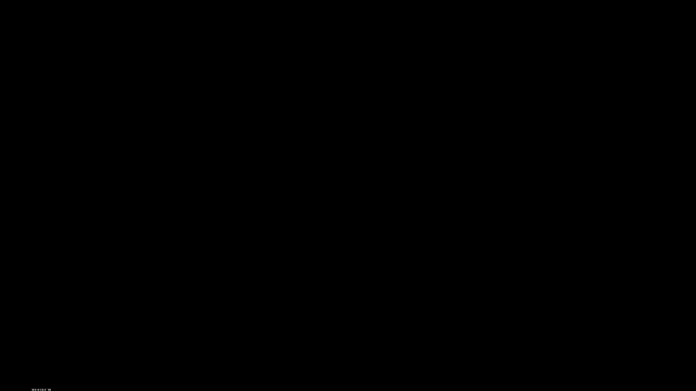
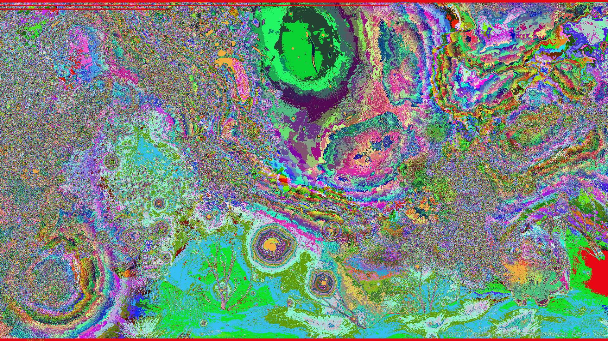
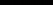
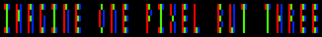

# Story Vocabulary

## Points: 250

## Challenge

Can you find the hidden message in this image?

Credit: goeo_#0527

Hint 1: If you're stuck, just look a little closer.

Hint 2: [This should give you the right idea](https://www.imdb.com/title/tt2120120/)

[story_vocabulary.png][1]

## Solution

On first observation, the black stripes at the top of the photo look particularly interesting. However, these stripes are a red herring. 

![story_vocabulary.png][1]

Open up the image in [stegsolve][3]:
```
$ java -jar stegsolve.jar
```

Scroll through the different planes. Keep an eye out for anything interesting. Take a closer look at plane 1 for red, green, and blue. The entire plane is black except for some data in the bottom left. Here's red plane 1:



Take a look at random color map 2:



Enlarge the interesting piece in the bottom left to get this:


Now this is interesting. It's not braille. The cipher seems separated into five sections. Maybe five letters? Or five words?

Take the original image and crop out just the interesting portion in order to get this tiny image:



Create a python [script](script.py) to examine the pixels in this image a little closer.

```python
from PIL import Image

image_file = 'story_vocabulary_subsection.png'
im = Image.open(image_file)
pixels = im.load()
imageSize = im.size

print("[x,y]: r g b")
print("------------")

# Iterate from top-to-bottom, left-to-right
for x in range(0, imageSize[0], 2):
    for y in range(imageSize[1]):
        color = pixels[x, y]
        print(f"[{x},{y}]: {color[0]} {color[1]} {color[2]}")
    print("")
```

This script prints output like this:
```
[x,y]: r g b
------------
[0,0]: 2 2 2
[0,1]: 0 2 0
[0,2]: 0 2 0
[0,3]: 0 2 0
[0,4]: 2 2 2
```

The entire output only contains 2's and 0's because only plane 1 contains data (0 or 1). Therefore, the resulting number is either 2 or 0:
```
               MSB           LSB
               v             v
red component: 0 0 0 0 0 0 1 0 = 0x02
               ^           | ^
               plane7      ^ plane0
                           plane1
```

Take a look at the output again and connect the lines that the 2's make. Modify the script to remove the 0's and the letters become clearer:
```
[0,0]: 2 2 2
[0,1]:   2  
[0,2]:   2  
[0,3]:   2  
[0,4]: 2 2 2

[2,0]: 2   2
[2,1]: 2 2 2
[2,2]: 2 2 2
[2,3]: 2   2
[2,4]: 2   2

[4,0]: 2 2 2
[4,1]: 2   2
[4,2]: 2 2 2
[4,3]: 2   2
[4,4]: 2   2

[6,0]: 2 2 2
[6,1]: 2    
[6,2]: 2   2
[6,3]: 2   2
[6,4]: 2 2 2

[8,0]: 2 2 2
[8,1]:   2  
[8,2]:   2  
[8,3]:   2  
[8,4]: 2 2 2

[10,0]: 2 2  
[10,1]: 2   2
[10,2]: 2   2
[10,3]: 2   2
[10,4]: 2   2

[12,0]: 2 2 2
[12,1]: 2    
[12,2]: 2 2 2
[12,3]: 2    
[12,4]: 2 2 2

[14,0]:      
[14,1]:      
[14,2]:      
[14,3]:      
[14,4]:      

[16,0]:   2  
[16,1]: 2   2
[16,2]: 2   2
[16,3]: 2   2
[16,4]:   2  

[18,0]: 2 2  
[18,1]: 2   2
[18,2]: 2   2
[18,3]: 2   2
[18,4]: 2   2

[20,0]: 2 2 2
[20,1]: 2    
[20,2]: 2 2 2
[20,3]: 2    
[20,4]: 2 2 2

[22,0]:      
[22,1]:      
[22,2]:      
[22,3]:      
[22,4]:      

[24,0]: 2 2  
[24,1]: 2   2
[24,2]: 2 2  
[24,3]: 2    
[24,4]: 2    

[26,0]: 2 2 2
[26,1]:   2  
[26,2]:   2  
[26,3]:   2  
[26,4]: 2 2 2

[28,0]: 2   2
[28,1]: 2   2
[28,2]:   2  
[28,3]: 2   2
[28,4]: 2   2

[30,0]: 2 2 2
[30,1]: 2    
[30,2]: 2 2 2
[30,3]: 2    
[30,4]: 2 2 2

[32,0]: 2    
[32,1]: 2    
[32,2]: 2    
[32,3]: 2    
[32,4]: 2 2 2

[34,0]:      
[34,1]:      
[34,2]:      
[34,3]:      
[34,4]:      

[36,0]: 2 2  
[36,1]: 2   2
[36,2]: 2 2  
[36,3]: 2   2
[36,4]: 2 2  

[38,0]: 2   2
[38,1]: 2   2
[38,2]: 2   2
[38,3]: 2   2
[38,4]: 2 2 2

[40,0]: 2 2 2
[40,1]:   2  
[40,2]:   2  
[40,3]:   2  
[40,4]:   2  

[42,0]:      
[42,1]:      
[42,2]:      
[42,3]:      
[42,4]:      

[44,0]: 2 2 2
[44,1]:   2  
[44,2]:   2  
[44,3]:   2  
[44,4]:   2  

[46,0]: 2   2
[46,1]: 2   2
[46,2]: 2 2 2
[46,3]: 2   2
[46,4]: 2   2

[48,0]: 2 2  
[48,1]: 2   2
[48,2]: 2 2  
[48,3]: 2   2
[48,4]: 2   2

[50,0]: 2 2 2
[50,1]: 2    
[50,2]: 2 2 2
[50,3]: 2    
[50,4]: 2 2 2

[52,0]: 2 2 2
[52,1]: 2    
[52,2]: 2 2 2
[52,3]: 2    
[52,4]: 2 2 2
```

At this point the flag is in plain sight. But what about the hints: "just look a little closer" and the movie "Pixels"? Delta also left a comment in the LHC discord regarding the challenge:
```
delta
Try looking at LCD monitors and specificly color blending (not sure if thats the right term)
```

Not sure what color blending is referring to. But "LCD monitors" is the hint that led to the discovery. An individual *pixel* in an LCD monitor is broken into three parts: red, green, and blue. And if observed *a little closer* as the hint suggests, the pixels look like this:


If the data of plane 1 determines which pixels turn on and off, the result is this:



[How to read the RGB value of a given pixel in Python?][2]

## Failed Attempts

Exiftool. Nothing interesting:
```
$ exiftool story_vocabulary.png 
ExifTool Version Number         : 10.80
File Name                       : story_vocabulary.png
Directory                       : .
File Size                       : 1871 kB
File Modification Date/Time     : 2020:05:28 22:54:35-06:00
File Access Date/Time           : 2020:06:03 22:50:17-06:00
File Inode Change Date/Time     : 2020:05:28 22:55:01-06:00
File Permissions                : rw-rw-r--
File Type                       : PNG
File Type Extension             : png
MIME Type                       : image/png
Image Width                     : 1920
Image Height                    : 1080
Bit Depth                       : 8
Color Type                      : RGB
Compression                     : Deflate/Inflate
Filter                          : Adaptive
Interlace                       : Noninterlaced
Image Size                      : 1920x1080
Megapixels                      : 2.1
```

Exif. Corrupt data:
```
$ exif story_vocabulary.png 
Corrupt data
The data provided does not follow the specification.
ExifLoader: The data supplied does not seem to contain EXIF data.
```

Strings. Nothing obvious:
```
$ strings story_vocabulary.png | less
IHDR
IDATx
x 2s
be$pI
2ihyY
zsddC
au       
K3#\
,%#\
K_~u3m
```

## Resources
* [Stegsolve Repository][2]
* [Stegsolve Jar File][3]
* https://github.com/ctfs/write-ups-2014/tree/master/plaid-ctf-2014/doge-stege
* https://georgeom.net/StegOnline/checklist
* https://georgeom.net/StegOnline/extract
* https://stegosuite.org/
* https://stackoverflow.com/a/9576717/2179970
* https://www.blackmoreops.com/2017/01/11/steganography-in-kali-linux-hiding-data-in-image/
* https://resources.infosecinstitute.com/steganalysis-x-ray-vision-hidden-data/
* http://www.guillermito2.net/stegano/tools/


[1]:./story_vocabulary.png
[2]:https://github.com/zardus/ctf-tools/blob/master/stegsolve/install
[3]:../../Tools/stegsolve.jar
[4]:https://stackoverflow.com/questions/138250/how-to-read-the-rgb-value-of-a-given-pixel-in-python