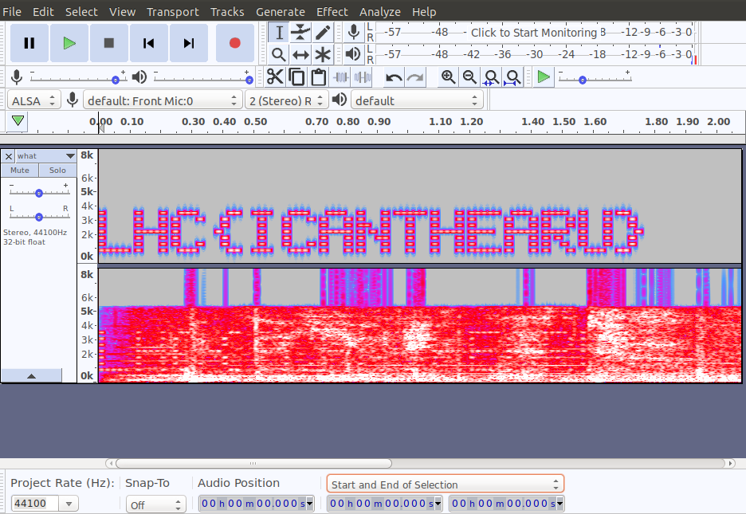

# What?

## Points: 100
You know this...

[what.wav](./what.wav)

## Solution
Install Audacity:
```
$ sudo apt install audacity
```

Open up the wav file. Choose **Spectrogram** mode with `Shift+M` then `S`.



## Fun Fact
There are two channels in the wav file. One contains the hidden message. The other contains dramatic music and a whisper "I know this". This sound byte is from Jurassic Park during the [velociraptor scene][1]. The girl runs up to the computer and whispers, "It's a Unix system. I know this." 

## References
* [How to Hide Secret Messages in Audio | Audio Steganography](https://www.youtube.com/watch?v=teShYhts2So)
* [Its a UNIX system! I know this! | Jurassic Park][1]

[1]:https://www.youtube.com/watch?v=URVS4H7vrdU